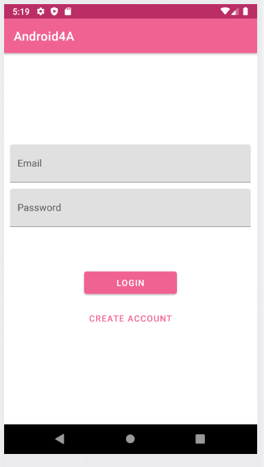
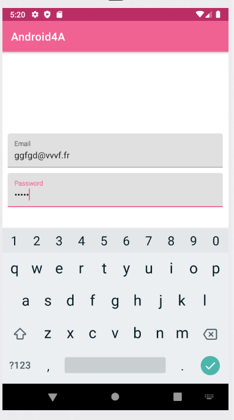
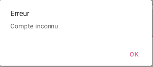

# Android4A, Application Android
* Auteure: Céline Lam
* Pseudo Github: kohashi20
* Classe: 4A

## Présentation
Il s'agit d'une application qui affiche une liste de musique, précisément des albums de Coldplay. Pour se faire, j'ai utilisé l'API TheAudioDB.
Les données sont stockées même lorsque le mode avion est activé. Un écran "détail" s'affiche si l'on clique sur un élément de la liste. Au lancement, nous tombons sur une page login.
L'application est codée en Kotlin.

## Prérequis
* Installation d'Android Studio
* Git
* Affichage d’écrans simples (activity)
* Affichage liste (recyclerview)
* Récupération de donnée en utilisant une API Rest (retrofit)
* Stockage de données (SharedPreferences)

## Consignes respectées
* Langage Kotlin
* Architecture MVVM
* Clean Architecture
* Utilisation d’une réelle BDD avec Room
* Utilisation Api Rest (essayé)
* Affichage d’une liste (essayé, avec le détail d'un élément et le stockage de données en cache mais cela a provoqué des erreurs)
* Design
* Tests unitaires
* Page Login (essayé mais je n'ai pu continuer car l'ajout du mot de passe a fait stopper l'application)
* Singleton
* Design Patterns
* Principes (SOLID, KISS, DRY)

## Fonctionnalités
* Ces fonctionnalités sont applicables lorsque l'on élimine les problèmes de mot de passe et de l'API Rest, ainsi que de l'affichage de la liste.
* Premier écran, dès le lancement de l'application

* Une fois que l'on écrit dans les champs

* Comme l'utilisateur n'est pas renseigné dans la base de données, nous obtenons cette erreur

